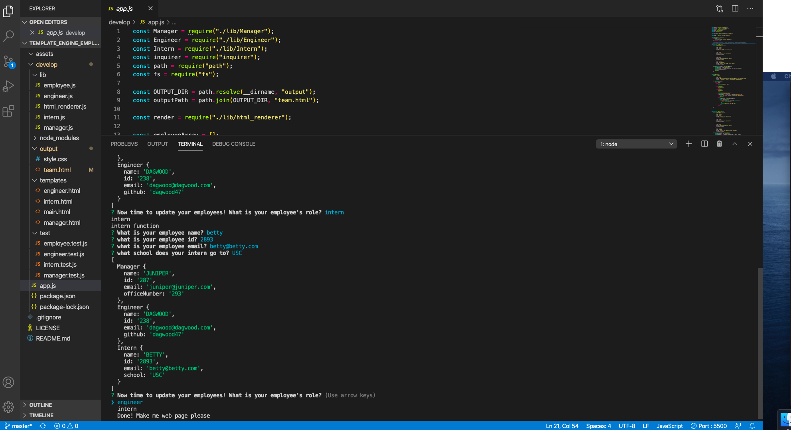

# template_engine_employee_summary
hw 7 template engine employee summary 

### Description
This application dynamically creates a website of employees through a command-line application using the [Inquirer package](https://www.npmjs.com/package/inquirer). The user only has to type node app.js in the terminal to begin the application. After this, the user is prompted to answer a series of questions regarding employee information. Once completed, the user then has a new file called team.html that they can open in a broswer and view their employees. CSS styling is added to the Bootstrap cards to standardize the width of the cards and also give a color based on type of employee. 

When the user beings the application, they are immediately addressed as the manager and the user is asked to answer information about themselves including name, id, email, and office number. Then the user is prompted to pick either engineer, intern, or done to create the html. The user is not given the choice to create the html unti after the user inputs the manager info to keep from having an empty web page. Then the user is asked to create a profile for their employees and can choose between engineer or intern or done. If they choose done, it gives the user a message to add an employee. After the user adds at least employee to the profiles then the user can click the done option. When the user chooses engineer or intern they are asked specific questions for the employee's profile. 

To test the functions, tests are also included in this package and each pass. To handle edge cases, I added a validate property on each inqurier prompt object. There is also a recursive function that continues to ask the user questions until they choose done. 

    
## Table of Contents
1. [Installation](#installation)
2. [Usage](#usage)
3. [License](#license)
4. [Contributing](#contributing)
5. [Tests](#tests)
6. [Questions](#questions)

### Images of Employee Profile Process

### Step 1

### Step 2

### Step 3

### Step 4

### Step 5

### Step 6

### Step 7

### Step 8

### Installation
In terminal, please make sure to npm init -y and npm i inquirer, then require the package in your js file. 

### Usage
This application can be used to generate an employee website. 

### License 

This application is covered under MIT.

### Contributing 
Pull requests are welcome. For major changes, please open an issue first to discuss what you would like to change.

### Tests
Please make sure to update tests as appropriate.

### Questions
1. [Github](https://github.com/nicoleremy95)

### Link to Video of Application
1. [EMPLOYEE PROFILES](https://drive.google.com/file/d/1XIR5b5sHZqeSox2YTBNKxbk67N34_sH-/view?usp=sharing)
    
    